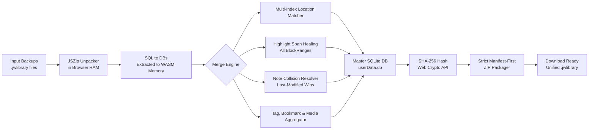

<p align="center">
  
</p>

<h1 align="center">JW Library Backup Merger 📖⚡</h1>

<p align="center">
  <strong>100% In-Browser & Private tool to merge JW Library (<code>.jwlibrary</code>) backups from iPad, iPhone, Android, and Windows PC.</strong>
</p>


[](https://github.com/kreier/jwlibrary-merge-web/actions/workflows/ci.yml)

---

## 📌 Table of Contents

- [Overview](#-overview)
- [Key Features](#-key-features)
- [Comparison vs Third-Party Tools](#-comparison-vs-third-party-tools)
- [How It Works (Architecture)](#-how-it-works-architecture)
- [How to Use](#-how-to-use)
- [Local Development](#-local-development)
- [Deployment](#-deployment)
- [Security & Privacy](#-security--privacy)
- [License](#-license)

---

## 🌟 Overview

When studying on multiple devices (such as preparing Watchtower articles or meeting parts on an iPad, taking field service notes on an iPhone, and conducting in-depth research on a laptop), your study data becomes fragmented.

**JW Library Backup Merger** solves this by unifying all your `.jwlibrary` backups into a single master backup file directly in your browser.

- 🔒 **Zero Server Uploads:** Your notes and personal data never leave your computer or phone. Everything runs locally in browser memory via **WebAssembly SQLite (`sql.js`)**.
- ⚡ **Multi-Paragraph Highlight Healing:** Accurately retains multi-verse and multi-paragraph highlight spans that other tools truncate.
- 📱 **All Devices Supported:** Apple (iPadOS, iOS, macOS), Android phones & tablets, and Windows PC.

---

## ✨ Key Features

| Feature | Description |
|---|---|
| 🔒 **100% In-Browser Privacy** | Merges SQLite databases in browser RAM. No servers, no tracking, works completely offline. |
| 🛡️ **Highlight Span Healing** | Retains all `BlockRange` rows associated with each `UserMarkGuid` across multi-paragraph highlights. |
| 🏷️ **Smart Conflict Resolution** | Full additive union for distinct highlights, bookmarks, and tags. Last-modified wins for note timestamp collisions. |
| 🧩 **Dynamic Schema Adaptation** | Automatically adapts across database schema versions (e.g. v14, v15, v16 with `Specialty`, `Edition` columns). |
| 🖼️ **Media & Attached Images** | Extracts and preserves custom playlist thumbnails, photo attachments, and notes artwork. |
| 📱 **Device Recognition** | Automatically detects and badges iPads, iPhones, Android devices, and Windows PCs. |
| 🔍 **Integrated Backup Explorer** | Inspect database tables, notes, bookmarks, and schema counts before and after merging. |
| 📲 **PWA & Mobile QR Pairing** | Built-in QR code modal for mobile camera scanning and Add to Home Screen support. |

---

## ⚖️ Comparison vs Third-Party Tools

| Feature | 🏆 JW Library Backup Merger (Web) | Legacy Desktop Tools (e.g. JWLMerge) |
|---|---|---|
| **Privacy & Zero Uploads** | ✅ 100% In-Browser WebAssembly | ⚠️ Requires native OS installer (.exe/.jar) |
| **Multi-Paragraph Highlights** | ✅ **100% Heals all `BlockRange` spans** | ❌ Truncates to 1st paragraph (`BlockRange` bug) |
| **Mobile & iPad Support** | ✅ Yes (Mobile Safari, Chrome, PWA) | ❌ Desktop only |
| **Media Attachments (.png/.jpg)** | ✅ Fully preserved in output ZIP | ⚠️ Often dropped or skipped |
| **SHA-256 Hash Recalculation** | ✅ Automatic Web Crypto SHA-256 | ⚠️ Can fail on schema version mismatches |
| **Installation Required** | ❌ None (Runs in any browser) | ⚠️ Requires Java / .NET runtime |

---

## 🏗️ How It Works (Architecture)



---

## 📖 How to Use

1. **Create Backups on Your Devices:**
   - In JW Library on each device: `Menu (☰)` &rarr; `Personal Study` &rarr; `Backup and Restore` &rarr; `Create Backup`.
2. **Open the Merger:**
   - Visit **[https://jwlibrary-merge.mastern8n.cc](https://jwlibrary-merge.mastern8n.cc)** (or scan the **Mobile QR** on your phone).
3. **Drop & Merge:**
   - Drag and drop your `.jwlibrary` files into the merger and click **Merge Backups**.
4. **Restore on All Devices:**
   - Download the unified `.jwlibrary` file and restore it on your devices (`Restore Backup`).

---

## 💻 Local Development

### Prerequisites
- Node.js 18+
- npm 10+

```bash
# Clone the repository
git clone https://github.com/JWCow/jwlibrary-merge-web.git
cd jwlibrary-merge-web

# Install dependencies
npm install

# Start Vite development server
npm run dev
```

Open `http://localhost:5173`.

### Production Build

```bash
npm run build
npm run preview
```

---

## 🚀 Deployment

The project is pre-configured for **Cloudflare Pages** and **Cloudflare Workers with Static Assets**:

- `wrangler.toml`:
  ```toml
  name = "jwlibrary-merge-web"
  compatibility_date = "2024-08-01"

  [assets]
  directory = "./dist"
  not_found_handling = "single-page-application"
  ```
- Build command: `npm run build`
- Output directory: `dist`

---

## 🔒 Security & Privacy

This project strictly adheres to a zero-telemetry, client-side only philosophy. Read our [Security Policy](SECURITY.md) for full details.

---

## 📄 License

Distributed under the **MIT License**. See [LICENSE](LICENSE) for more information.
